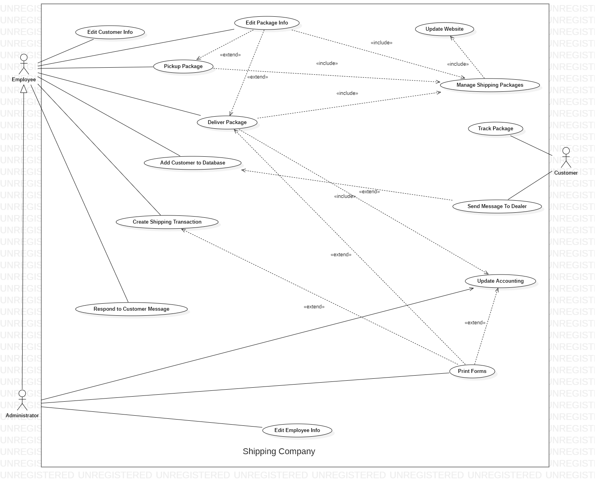
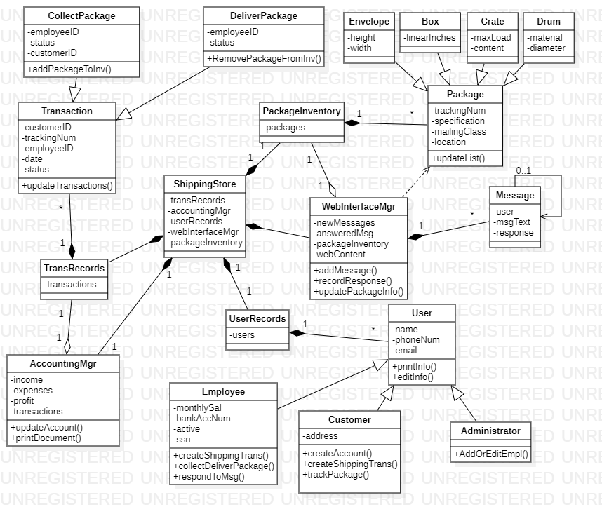
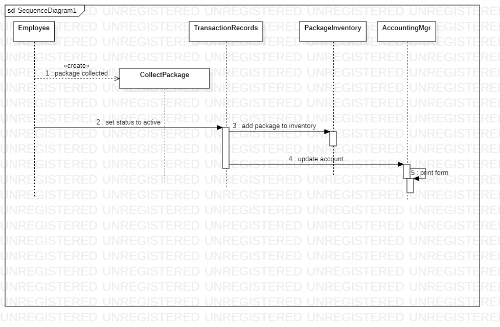

# ADS
Scott, Himaja, Daniel
###  1. Use Cases and Use Case 
---

**Use Case: Manage Shipping Packages**
* The System maintains all completed or ongoing shipment transactions. This list is updated as packages are initialized, delivered and completed

**Use Case: Update Website**
* The website promotes communication between the customer and the employee. Shipping transaction information can be found here.

**Use Case: Edit Package Info**
* Employee can update, add or remove a package from inventory
* When the package is delivered, the package is removed from inventory (Use Case: Manage Shipping Packages) which updates website info (Use case: Update Website)

**Use Case: Create Shipping Transaction**
* Customer or Employee can create a transaction on the website or employee can do it at the store 
* Add package to system (Use Case: Manage Shipping Packages) 

**Use Case: Pickup Package**
* Add Employee ID to package info and inventory (Use Case: Edit Package info)
* Package status is changed to Active (Use Case: Edit Package Info)

**Use Case: Deliver Package**
* Package removed from inventory (Use Case: Edit Package Info)
* Package status is changed to Completed
* Update accounting with profit (Use Case: Update Accounting)
* (OPTIONAL) Print transaction form (Use Case: Print Forms) 

**Use Case: Update Accounting**
* It keeps track of income, expenses and profit from shipping transactions and salary payments
* Administrator can optionally print forms

**Use Case: Add Customer to Database**
* Allows employee to add information about new customer to database
* Allows customer to create account on website

**Use Case: Edit Customer Info**
* Allows employee to edit the information of a customer or package
* Allows customer to edit information of their account
* Employees types updated information.

**Use Case: Respond to Customer Msg**
* Allows employee to respond to a question sent by a customer through the website
* Unanswered messages are pulled from question queue and displayed to employee
* An email response from employee is sent to the customer

**Use Case: Edit Employee Info**
* Allows system administrators to add/update/delete employees or administrators to and from the system
* A new employee record is created/changed/removed from database

**Use Case: Print Forms**
* Allows administrators to print financial forms (Balance Sheets, Cash Flow, Invoice, etc.)
* Allows Employees or Customers to print receipt or labels

**Use Case: Track Package**
* Allows customers to create an account, create a shipping transaction, track packages
* Package info is displayed to customers

**Use Case: Send Message to Dealer**
* Allows customer to send message to Shipping Company with questions
* Customers type their info and message
* Customers need an account to create a message (Use Case: Add Customer to Database)
* Message placed in messages queue

### 2. CRC Cards and Class Diagram

### 3. Sequence Diagram for new shipping transaction

The sequence diagram below shows the sequence of operations for an employee to create 
new shipping transaction and collect the package from the customer.

